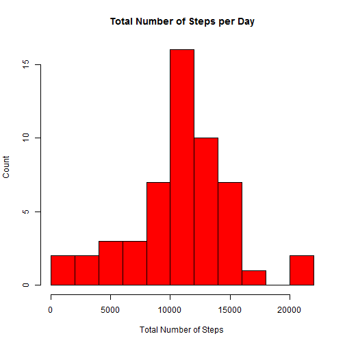
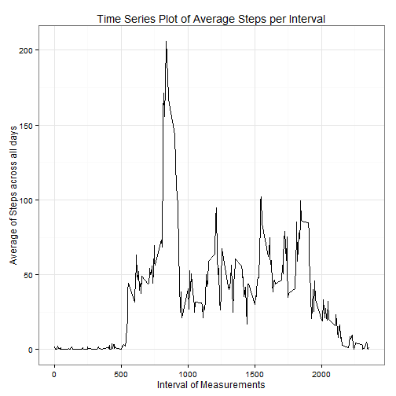
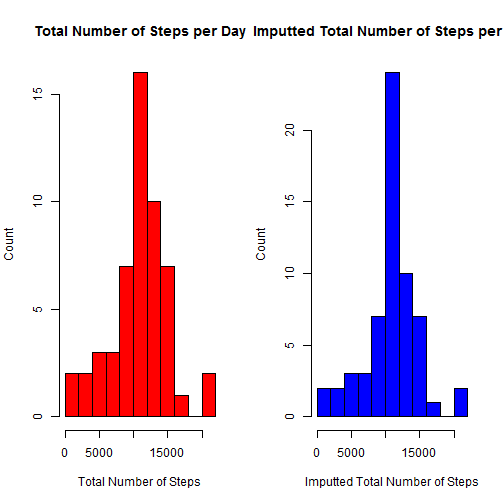
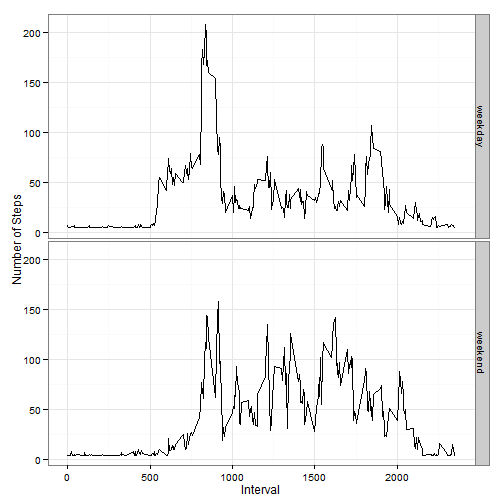

R Markdown for the Peer Assessment 1 of Reproducible Research Course
====================================================================

## Loading and preprocessing the data

At this point We need to import the data and transform the variable Date to a date format.


```r
data<-read.csv("activity.csv")
data$date<-as.Date(data$date,"%Y-%m-%d")
str(data)
```

```
## 'data.frame':	17568 obs. of  3 variables:
##  $ steps   : int  NA NA NA NA NA NA NA NA NA NA ...
##  $ date    : Date, format: "2012-10-01" "2012-10-01" ...
##  $ interval: int  0 5 10 15 20 25 30 35 40 45 ...
```

## What is mean total number of steps taken per day?

Lets first take a look at a histogram of the total number of steps of each day:


```r
library(plyr)
datanotna <-  data[is.na(data$steps)==FALSE,]
sumsteps <- ddply(datanotna,~date,summarise,totalsteps=sum(steps))
hist(sumsteps$totalsteps,breaks=15,main="Total Number of Steps per Day",xlab="Total Number of Steps",ylab="Count",col="red")
```

 

Now lets look to the mean and meadian of the total number of steps taken per day:


```r
paste("Mean of # of Steps: ",round(mean(sumsteps$totalsteps),0))
```

```
## [1] "Mean of # of Steps:  10766"
```

```r
paste("Median of # of Steps: ",median(sumsteps$totalsteps))
```

```
## [1] "Median of # of Steps:  10765"
```


## What is the average daily activity pattern?

Answering this question, lets take a look at the average registers of steps on every interval of 5 minutes acro across all days:


```r
avgsteps <- ddply(datanotna,~interval,summarise,meansteps=mean(steps,na.rm=TRUE))
library(ggplot2)
g <- ggplot(avgsteps,aes(interval,meansteps))
g+ theme_bw() +geom_line() + labs(x="Interval of Measurements",y="Average of Steps across all days",title="Time Series Plot of Average Steps per Interval")
```

 

Now lets see what interval has the maximum number of steps ordering the dataset by the average of steps:

```r
head(avgsteps[order(-avgsteps$meansteps),],5)
```

```
##     interval meansteps
## 104      835     206.2
## 105      840     195.9
## 107      850     183.4
## 106      845     179.6
## 103      830     177.3
```

```r
maxinterval = avgsteps[avgsteps$meansteps==max(avgsteps$meansteps),1]
maxsteps = round(avgsteps[avgsteps$meansteps==max(avgsteps$meansteps),2],0)
```

So, the interval that has the maximum average value is 835 with the average of 206 steps across al days.

## Imputing missing values
After checking if there is any NA values on the fields date and interval:

```r
paste(sum(is.na(data[,1])),sum(is.na(data[,2])),sum(is.na(data[,3])))
```

```
## [1] "2304 0 0"
```

We notice that only exists NA on the field steps, the first colum of the data.

```r
totalna <- sum(is.na(data[,1]))
```

The total number of lines with NAs are 2304.

Now we're going to imput the missing values of steps with the general mean of the steps and create another dataset filled:


```r
dataimputted <-data
dataimputted$steps[is.na(dataimputted$steps)==TRUE]<-mean(dataimputted$steps,na.rm=TRUE)
paste("Number of missings on each column:",sum(is.na(dataimputted[,1])),sum(is.na(dataimputted[,2])),sum(is.na(dataimputted[,3])))
```

```
## [1] "Number of missings on each column: 0 0 0"
```

Lets compare the histogram for the dataset with missings and the imputted dataset:

```r
ss_dataimputted <- ddply(dataimputted,~date,summarise,totalsteps=sum(steps))

par(mfrow=c(1,2))
hist(sumsteps$totalsteps,breaks=15,main="Total Number of Steps per Day",xlab="Total Number of Steps",ylab="Count",col="red")
hist(ss_dataimputted$totalsteps,breaks=15,main="Imputted Total Number of Steps per Day",xlab="Imputted Total Number of Steps",ylab="Count",col="blue")
```

 

Lets take a look at the mean and median of each average of steps of the datasets:

```r
paste("Mean of # of Steps: ",round(mean(sumsteps$totalsteps),0), "vs Mean of # of Imputted Steps: ",round(mean(ss_dataimputted$totalsteps),0))
```

```
## [1] "Mean of # of Steps:  10766 vs Mean of # of Imputted Steps:  10766"
```

```r
paste("Median of # of Steps: ",round(median(sumsteps$totalsteps),0), "vs Median of # of Imputted Steps: ",round(median(ss_dataimputted$totalsteps),0))
```

```
## [1] "Median of # of Steps:  10765 vs Median of # of Imputted Steps:  10766"
```

On this dataset, We didn't see much difference between the values of mean and meadian after the imputtation, but the distribution of the values has. We have to be very carefully when imputtind values.


## Are there differences in activity patterns between weekdays and weekends?

To see the difference between weekdays and weekends, We need to create a factor variable on the dataset:


```r
dataimputted$week=NULL
for (i in 1:dim(dataimputted)[1]) {
    if (weekdays(dataimputted$date[i],abbreviate = TRUE)=="sáb" | weekdays(dataimputted$date[i],abbreviate = TRUE)=="dom") {
        dataimputted$week[i]<-as.character("weekend")
        } else {  
            dataimputted$week[i]<-as.character("weekday")
        
    } 
}

dataimputted <- transform(dataimputted,week=factor(week))

table(weekdays(dataimputted$date,abbreviate = TRUE))
```

```
## 
##  dom  qua  qui  sáb  seg  sex  ter 
## 2304 2592 2592 2304 2592 2592 2592
```

```r
table(dataimputted$week)
```

```
## 
## weekday weekend 
##   12960    4608
```

Lets see if there is a difference between the distribution of the average number of steps in both of the types of days:


```r
avgsteps_week <- ddply(dataimputted,~interval+week,summarise,meansteps=mean(steps,na.rm=TRUE))
library(ggplot2)
g <- ggplot(avgsteps_week,aes(interval,meansteps,week))
g + theme_bw() + geom_line() + facet_grid(week~.) + labs(x="Interval",y="Number of Steps")
```

 


